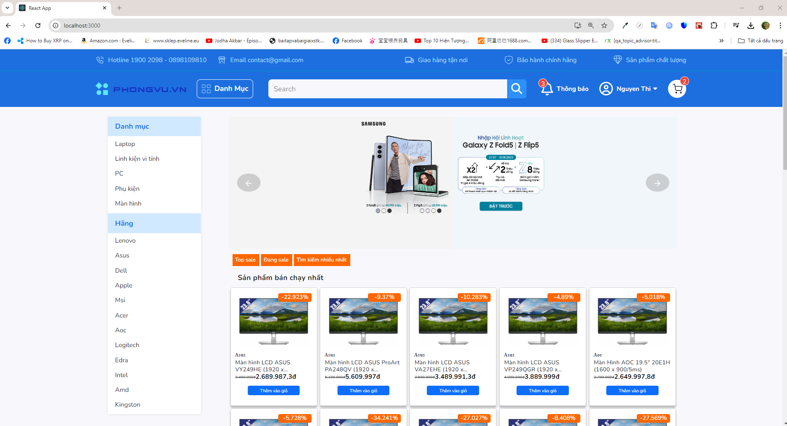

# Introduction
- An internship project that I joined in my third year (Jul 2023 - Sep 2023). 

# Technology
- ReactJS
- NodeJS
- ExpressJS
- MongoDB
- Authentication with JSON Web Token
  
# Main Feature
- Website seling laptop with basic features (rendering products by categories, search, see detail, add to cart, payment, tracking orders, etc...)

# What did I do?
- Working at both the front-end and back-end, I was mainly responsible for authentication, home page, detail page, search, and  add-to-cart logic on both sides. Besides, I was also in charge of managing the database side.

# What did I learn?
- Working in teams
- Designing UI with Figma
- Buiding UI with ReactJS
- Writing restful API with ExpressJS framework
- Using MongoDB for database management
  
# Installation
- Make sure you clone the <a href='https://github.com/nguyenkieuchauanh0908/Backend-Uptech'>Backend</a>
- Installing nodejs v18 (at least)
- Follow these steps
  1. Run <code>npm i </code> to install all necessary libraries and packages
  2. Run <code>npm start </code> to start the server. The server will run with the default local port 3000

# Previews
1. Login

   
   
3. Sign up

   
   
5. Home Page

   
   
7. Detail Page

   
   
9. Filter by categories

   
   
11. Cart

    
    
13. Payment
    

# What can do next?
- Improve the authentication route (it's quite simple now and can be easily attacked by hackers)
- Improve performance of the website (lazy loading, cache memory, etc...)
- Add advanced filter features (filter by price, distance, etc)
